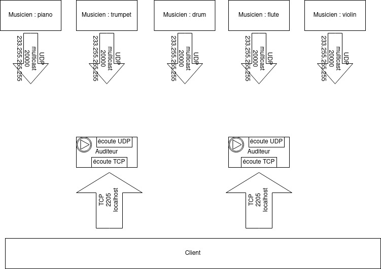

# Teaching-HEIGVD-RES-2020-Labo-Orchestra

> Jérôme Arn 


## Requirements

In this lab, you will **write 2 small NodeJS applications** and **package them in Docker images**:

* the first app, **Musician**, simulates someone who plays an instrument in an orchestra. When the app is started, it is assigned an instrument (piano, flute, etc.). As long as it is running, every second it will emit a sound (well... simulate the emission of a sound: we are talking about a communication protocol). Of course, the sound depends on the instrument.

* the second app, **Auditor**, simulates someone who listens to the orchestra. This application has two responsibilities. Firstly, it must listen to Musicians and keep track of **active** musicians. A musician is active if it has played a sound during the last 5 seconds. Secondly, it must make this information available to you. Concretely, this means that it should implement a very simple TCP-based protocol.


### Instruments and sounds

The following table gives you the mapping between instruments and sounds. Please **use exactly the same string values** in your code, so that validation procedures can work.

| Instrument | Sound         |
|------------|---------------|
| `piano`    | `ti-ta-ti`    |
| `trumpet`  | `pouet`       |
| `flute`    | `trulu`       |
| `violin`   | `gzi-gzi`     |
| `drum`     | `boum-boum`   |

### TCP-based protocol to be implemented by the Auditor application

* The auditor should include a TCP server and accept connection requests on port 2205.
* After accepting a connection request, the auditor must send a JSON payload containing the list of <u>active</u> musicians, with the following format (it can be a single line, without indentation):

```
[
  {
  	"uuid" : "aa7d8cb3-a15f-4f06-a0eb-b8feb6244a60",
  	"instrument" : "piano",
  	"activeSince" : "2016-04-27T05:20:50.731Z"
  },
  {
  	"uuid" : "06dbcbeb-c4c8-49ed-ac2a-cd8716cbf2d3",
  	"instrument" : "flute",
  	"activeSince" : "2016-04-27T05:39:03.211Z"
  }
]
```

### What you should be able to do at the end of the lab


You should be able to start an **Auditor** container with the following command:

```
$ docker run -d -p 2205:2205 res/auditor
```

You should be able to connect to your **Auditor** container over TCP and see that there is no active musician.

```
$ telnet IP_ADDRESS_THAT_DEPENDS_ON_YOUR_SETUP 2205
[]
```

You should then be able to start a first **Musician** container with the following command:

```
$ docker run -d res/musician piano
```

After this, you should be able to verify two points. Firstly, if you connect to the TCP interface of your **Auditor** container, you should see that there is now one active musician (you should receive a JSON array with a single element). Secondly, you should be able to use `tcpdump` to monitor the UDP datagrams generated by the **Musician** container.

You should then be able to kill the **Musician** container, wait 5 seconds and connect to the TCP interface of the **Auditor** container. You should see that there is now no active musician (empty array).

You should then be able to start several **Musician** containers with the following commands:

```
$ docker run -d res/musician piano
$ docker run -d res/musician flute
$ docker run -d res/musician flute
$ docker run -d res/musician drum
```
When you connect to the TCP interface of the **Auditor**, you should receive an array of musicians that corresponds to your commands. You should also use `tcpdump` to monitor the UDP trafic in your system.


## Task 1: design the application architecture and protocols

| #  | Topic |
| --- | --- |
|Question | How can we represent the system in an **architecture diagram**, which gives information both about the Docker containers, the communication protocols and the commands? |
| |  |
|Question | Who is going to **send UDP datagrams** and **when**? |
| | Les musiciens toutes les secondes pour dire qu'ils jouent. |
|Question | Who is going to **listen for UDP datagrams** and what should happen when a datagram is received? |
| | L'auditeur, il doit détecter via l'UUID du musiciens si cela fait plus que 5 secondes qu'il joue. Si c'est le cas il doit rendre visible le musicien pour l'utilisateur. |
|Question | What **payload** should we put in the UDP datagrams? |
| | Dans le datagramme UDP il faudra mettre |
|Question | What **data structures** do we need in the UDP sender and receiver? When will we update these data structures? When will we query these data structures? |
| | Pour faire la traduction de son à instrument et vice-versa, j'ai utilisé des map. Pour stocker les musiciens d'un autditeur, j'ai utilisé la même structure. Je mets cette liste à jour chaque fois que l'auditeur entend un son et qu'un utilisateur demande la liste des musiciens actifs. Quand l'utilisateur se connectera à l'auditeur pour savoir quels sont les musiciens actifs, l'auditeur va "trier" sa liste de musicien. Par contre dans la map il y a des informations qui ne sont pas utiles à l'utilisateur. on construit un tableau à la volée qu'on lui envoie. |


## Task 2: implement a "musician" Node.js application

| #  | Topic |
| ---  | --- |
|Question | In a JavaScript program, if we have an object, how can we **serialize it in JSON**? |
| | Pour sérialiser un objet en JSON, j'ai utilisé **JSON.stringify(myObj)**. |
|Question | What is **npm**?  |
| | C'est un gestionnaire de paquet pour Node js. |
|Question | What is the `npm install` command and what is the purpose of the `--save` flag?  |
| | Cette option permet d'ajouter le paquet installer avec son numéro de version dans la section depencies de `package.json` |
|Question | How can we use the `https://www.npmjs.com/` web site?  |
|  | On peut rechercher les paquets dont on a besoin ainsi que leurs documenttations respectives. |
|Question | In JavaScript, how can we **generate a UUID** compliant with RFC4122? |
| | En utilisant le paquage uuid et en appelant sa méthode uuid.v4(). |
|Question | In Node.js, how can we execute a function on a **periodic** basis? |
| | setInterval(<function name>, <time in ms>); |
|Question | In Node.js, how can we **emit UDP datagrams**? |
|          | Dans mon implémentation, j'utilise le paquet dgram et je crée une socket. Je me bind sur le port **20000** à l'adresse **233.255.255.255**. Puis j'envoie les données sous format JSON en multicast. |
|Question | In Node.js, how can we **access the command line arguments**? |
| | Pour accéder aux arguments passer par la ligne de commande, il faut utiliser **process.argv[2]** qui correspond au premier argument. |


## Task 3: package the "musician" app in a Docker image

| #  | Topic |
| ---  | --- |
|Question | How do we **define and build our own Docker image**?|
| | Tout d'abord on définit un **Dockerfile** avec l'image, les paquets à installer, la copie des fichiers sources dans le container et la commande permettant l'exécution du container. Ensuite on contruit l'image avec la commande **docker build -t res/musician** |
|Question | How can we use the `ENTRYPOINT` statement in our Dockerfile?  |
| | On peut l'utiliser de cette manière **ENTRYPOINT ["node", "/opt/app/index.js"]** pour pouvoir exécuter l'application avec des arguments que l'on voudrait lui passer. Et surtout on peut considérer le container comme un exécutable |
|Question | After building our Docker image, how do we use it to **run containers**?  |
| | **docker run -d (pour l'exécuter en arrière plan) <docker image name> <argument>** |
|Question | How do we get the list of all **running containers**?  |
| | **docker ps** |
|Question | How do we **stop/kill** one running container?  |
| | **docker kill <docker image name>** mais pour cela il faut faire un docker ps pour savoir le nom du container que l'on veut stop. |
|Question | How can we check that our running containers are effectively sending UDP datagrams?  |
| | On peut observer le trafic avec `wireshark` ou avec `tcpdump`. |


## Task 4: implement an "auditor" Node.js application

| #  | Topic |
| ---  | ---  |
|Question | With Node.js, how can we listen for UDP datagrams in a multicast group? |
|          | On se met en écoute sur le même port et la même adresse que les musiciens. Et quand un event de type message arrive on traite les données. |
|Question | How can we use the `Map` built-in object introduced in ECMAScript 6 to implement a **dictionary**?  |
| | On définit les sons des instruments comme les clés et on leurs attribuent l'instrument correcpondant comme donnée. |
|Question | How can we use the `Moment.js` npm module to help us with **date manipulations** and formatting?  |
| | Je l'utilise pour avoir le bon format pour le champ **ActiveSince** que j'affiche à l'utilisateur. |
|Question | When and how do we **get rid of inactive players**?  |
| | Je stocke mes musiciens dans la map au fur et à mesure qu'ils arrivent. Lorsque le client demande la liste des musiciens actifs, je regarde quels musiciens sont encore actifs (en regardant de quand date leurs derniers sons). Si le dernier son émit est plus vieux que 5 secondes je ne l'envoie pas à l'utilisateur et je le supprime de la map. |
|Question | How do I implement a **simple TCP server** in Node.js?  |
| | En utilisant le paquet **net** et un event de type **connection**. à noter que je ferme direcement la connexion avec le client après lui avoir envoyé les données. |


## Task 5: package the "auditor" app in a Docker image

| #  | Topic |
| ---  | --- |
|Question | How do we validate that the whole system works, once we have built our Docker image? |
|  | J'ai fait des tests manuels et j'ai exécuter le script **validate.sh** |


## Constraints

Please be careful to adhere to the specifications in this document, and in particular

* the Docker image names
* the names of instruments and their sounds
* the TCP PORT number

Also, we have prepared two directories, where you should place your two `Dockerfile` with their dependent files.

Have a look at the `validate.sh` script located in the top-level directory. This script automates part of the validation process for your implementation (it will gradually be expanded with additional operations and assertions). As soon as you start creating your Docker images (i.e. creating your Dockerfiles), you should try to run it.
